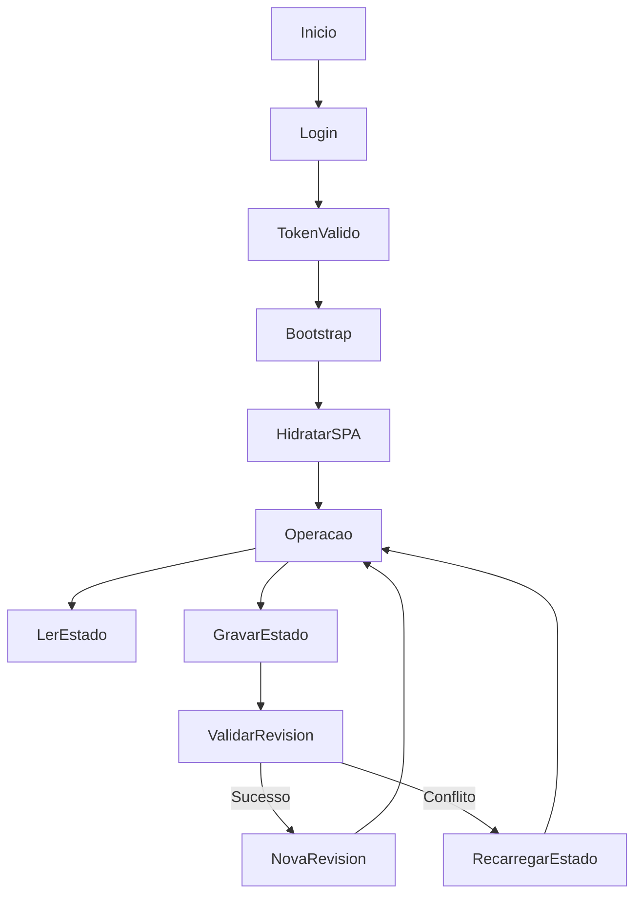

# Fluxos Runtime

## Objetivo

Descrever como o sistema opera em tempo de execução.

## Escopo

Inclui inicialização, autenticação, bootstrap, persistência incremental e fluxos operacionais principais.

## Conteúdo

Fluxos runtime identificados:

- login e obtenção de token
- bootstrap do estado inicial
- leituras e escritas incrementais de estrutura, inventário, descargas, saídas e planta
- renderização de telas por SPA
- fila offline em IndexedDB
- cache/fallback básico com Service Worker

Fluxo macro de runtime:

Processos detalhados existentes:

- [autenticacao.md](../processos/processos/autenticacao.md)
- [bootstrap_estado_inicial.md](../processos/processos/bootstrap_estado_inicial.md)
- [gestao_estrutural_depositos_prateleiras.md](../processos/processos/gestao_estrutural_depositos_prateleiras.md)
- [cadastro_edicao_manual_produtos.md](../processos/processos/cadastro_edicao_manual_produtos.md)
- [movimentacao_manual_entre_gavetas.md](../processos/processos/movimentacao_manual_entre_gavetas.md)
- [conferencia_cega_descarga.md](../processos/processos/conferencia_cega_descarga.md)
- [aprovacao_reprovacao_descarga.md](../processos/processos/aprovacao_reprovacao_descarga.md)
- [alocacao_itens_conferidos_estoque.md](../processos/processos/alocacao_itens_conferidos_estoque.md)
- [separacao_carrinho_saida.md](../processos/processos/separacao_carrinho_saida.md)
- [geracao_saida_ou_descarte.md](../processos/processos/geracao_saida_ou_descarte.md)
- [validacao_fefo_bloqueio_validade.md](../processos/processos/validacao_fefo_bloqueio_validade.md)
- [geracao_leitura_qr.md](../processos/processos/geracao_leitura_qr.md)
- [calculo_qualidade_destinacao.md](../processos/processos/calculo_qualidade_destinacao.md)
- [importacao_exportacao_restauracao_local.md](../processos/processos/importacao_exportacao_restauracao_local.md)
- [backup_banco_zip.md](../processos/processos/backup_banco_zip.md)

- arquivo: `docs/processos/*.md`
  artefato: seções "Fluxo Técnico"
  motivo: detalham execução funcional e técnica.

## Lacunas

- Fluxos assíncronos fora da aplicação HTTP não foram identificados no código atual.
