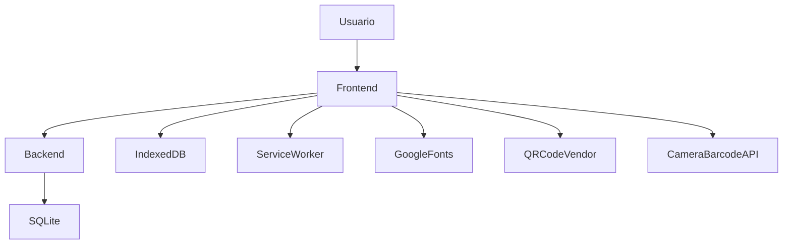

# Visão de Contexto

## Objetivo

Descrever os blocos macro que compõem o sistema e suas relações.

## Escopo

Inclui frontend, backend, banco e integrações confirmadas.

## Conteúdo

Blocos principais:

- Frontend em HTML, CSS e JavaScript puro servido por templates Jinja2
- Backend FastAPI com autenticação, permissões, rotas operacionais e persistência
- Banco principal SQLite acessado por SQLAlchemy assíncrono
- Integrações de navegador e bibliotecas auxiliares

Fluxo macro:

## Lacunas

- Topologia de rede, proxy reverso e balanceamento não foram identificados no código atual.
