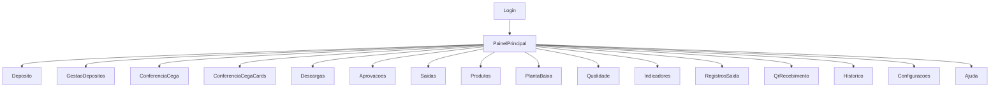

# Mapa de Telas

## Objetivo

Consolidar as telas identificadas e sua forma de acesso.

## Escopo

Inclui todas as telas listadas no inventário técnico.

## Conteúdo

Telas identificadas:

- Login
- Depósito
- Gestão de depósitos
- Conferência cega
- Conferência cega cards
- Descargas
- Aprovações
- Saídas
- Produtos
- Planta baixa
- Qualidade
- Indicadores
- Registros de saída
- QR e recebimento
- Histórico
- Configurações
- Ajuda

Mapa resumido:

Arquivos detalhados:

- [login.md](06-telas/login.md)
- [deposito.md](06-telas/deposito.md)
- [gestao_de_depositos.md](06-telas/gestao_de_depositos.md)
- [conferencia_cega.md](06-telas/conferencia_cega.md)
- [conferencia_cega_cards.md](06-telas/conferencia_cega_cards.md)
- [descargas.md](06-telas/descargas.md)
- [aprovacoes.md](06-telas/aprovacoes.md)
- [saidas.md](06-telas/saidas.md)
- [produtos.md](06-telas/produtos.md)
- [planta_baixa.md](06-telas/planta_baixa.md)
- [qualidade.md](06-telas/qualidade.md)
- [indicadores.md](06-telas/indicadores.md)
- [registros_de_saida.md](06-telas/registros_de_saida.md)
- [qr_e_recebimento.md](06-telas/qr_e_recebimento.md)
- [historico.md](06-telas/historico.md)
- [configuracoes.md](06-telas/configuracoes.md)
- [ajuda.md](06-telas/ajuda.md)

## Lacunas

- Fluxos de navegação condicionados por perfil entre todas as telas não foram identificados no código atual.
