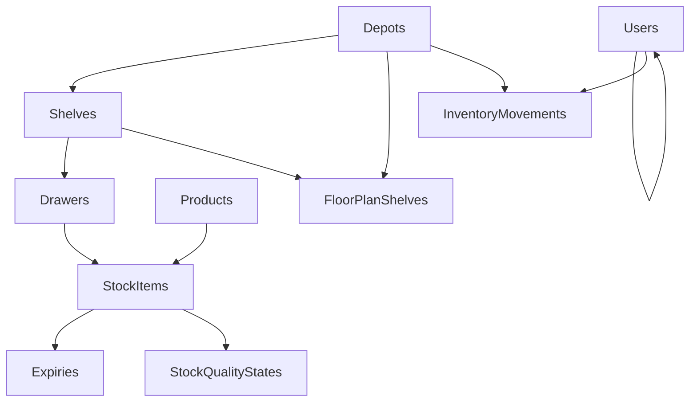

# Relacionamentos

## Objetivo

Documentar os relacionamentos confirmados entre entidades.

## Escopo

Abrange apenas relacionamentos explicitamente citados no inventário técnico.

## Conteúdo

Relacionamentos confirmados:

- `users.parent_user_id` cria auto-relacionamento hierárquico em `users`
- `depots` 1:N `shelves`
- `shelves` N:1 `depots`
- `shelves` 1:N `drawers`
- `drawers` N:1 `shelves`
- `drawers` 1:N `stock_items`
- `products` 1:N `stock_items`
- `stock_items` N:1 `products`
- `stock_items` N:1 `drawers`
- `stock_items` 1:N `expiries`
- `expiries` N:1 `stock_items`
- `inventory_movements` possui FK opcional para `users` e `depots`
- `stock_quality_states` relaciona-se a `stock_items`, `depots`, `shelves` e `drawers`
- `floorplan_shelves` relaciona-se a `depots` e `shelves`

Visão resumida:

## Lacunas

- Cardinalidades de tabelas auxiliares de sincronização e regras de integridade completas não foram identificadas no código atual.
