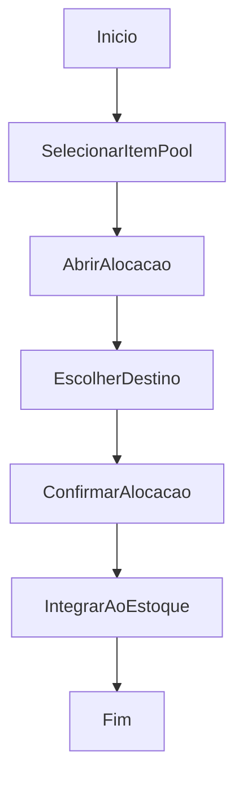

# Alocação de Itens Conferidos no Estoque

## Objetivo

Endereçar no estoque os itens já conferidos na descarga.

## Gatilho

Abertura do modal de alocação a partir da conferência cega.

## Pré-condições

- Item presente na pool da conferência
- Estrutura de destino disponível
- Usuário autenticado

## Fluxo Funcional

1. O usuário seleciona um item conferido.
2. Abre a alocação.
3. Escolhe depósito, prateleira e gaveta de destino.
4. Confirma a alocação.
5. O item é integrado ao estoque.

## Fluxo Técnico

1. O frontend abre o modal por `openBlindAllocateModal`.
2. O usuário seleciona o destino.
3. O frontend move o item da pool para `productsAll`.
4. O frontend persiste inventário e estado de descarga.
5. Fluxo detalhado de persistência cruzada: Fluxo incompleto no código atual.

## Fluxograma

