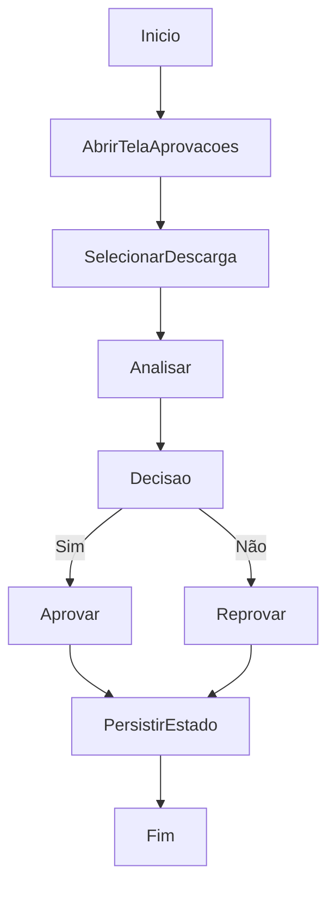

# Aprovação e Reprovação de Descarga

## Objetivo

Revisar descargas e decidir por aprovação ou reprovação.

## Gatilho

Acesso à tela de aprovações.

## Pré-condições

- Usuário autenticado
- Descargas existentes para revisão
- Permissão compatível com revisão

## Fluxo Funcional

1. O usuário abre a tela de aprovações.
2. Visualiza descargas pendentes ou reprovadas.
3. Analisa a descarga.
4. Aprova ou reprova o registro.

## Fluxo Técnico

1. O frontend renderiza a página com `renderUnloadReviewPage`.
2. Os dados vêm do estado persistido de descargas.
3. A decisão altera o estado da descarga.
4. O frontend persiste o novo estado em `PUT /api/wms/unloads-state`.

## Fluxograma

