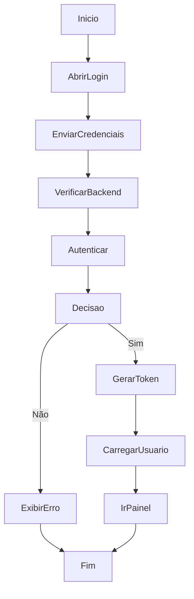

# Autenticação

## Objetivo

Autenticar o usuário, validar a sessão e liberar acesso ao painel principal.

## Gatilho

O usuário acessa `/login` e envia o formulário de login.

## Pré-condições

- Backend disponível
- Usuário existente no banco
- Credenciais válidas

## Fluxo Funcional

1. O usuário abre a tela de login.
2. Informa usuário e senha.
3. Aciona o botão de entrada.
4. Se a autenticação for aceita, o sistema redireciona para a aplicação principal.
5. Se a autenticação falhar, a tela exibe erro.

## Fluxo Técnico

1. `login.html` executa `doLogin()`.
2. O frontend verifica a saúde do backend.
3. O frontend envia `POST /api/auth/login`.
4. O backend aplica rate limiting e autentica o usuário.
5. Se válido, o backend gera JWT e registra auditoria de sucesso.
6. O frontend armazena o token em `sessionStorage`.
7. O frontend consulta `GET /api/auth/me`.
8. O frontend grava o usuário atual em memória de sessão e redireciona para `/`.

## Fluxograma

