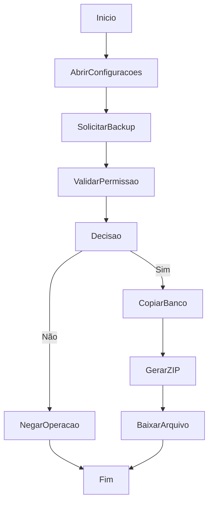

# Geração de Backup do Banco

## Objetivo

Gerar e baixar um arquivo ZIP contendo o banco SQLite atual.

## Gatilho

Clique no botão de backup na área de configurações.

## Pré-condições

- Usuário autenticado
- Permissão `clear.all`
- Arquivo do banco existente

## Fluxo Funcional

1. O usuário acessa configurações.
2. Aciona a geração de backup.
3. O sistema prepara o arquivo.
4. O navegador inicia o download do ZIP.

## Fluxo Técnico

1. O frontend executa `downloadAdminBackup`.
2. O frontend chama `GET /api/wms/admin/backup` com token.
3. O backend executa `download_admin_backup`.
4. O backend usa `sqlite3.backup()` para copiar o banco.
5. O backend empacota o arquivo em ZIP.
6. O backend responde com `Content-Disposition` para download.

## Fluxograma

