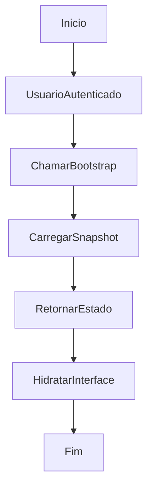

# Bootstrap do Estado Inicial

## Objetivo

Carregar o estado inicial completo necessário para montar a interface principal.

## Gatilho

Abertura do painel principal após autenticação válida.

## Pré-condições

- Usuário autenticado
- Token disponível no frontend

## Fluxo Funcional

1. O usuário entra no painel.
2. O sistema carrega o estado atual do WMS.
3. A interface é montada com depósitos, estoque, histórico, planta e demais dados persistidos.

## Fluxo Técnico

1. O frontend validado chama a API com o token.
2. O backend executa `bootstrap_wms_state`.
3. O backend garante a existência de `sync_state` e `wms_state_snapshots`.
4. O backend atualiza `last_pulled_at`.
5. O backend retorna `revision` e `state`.
6. O frontend hidrata a aplicação com o snapshot recebido.

## Fluxograma

