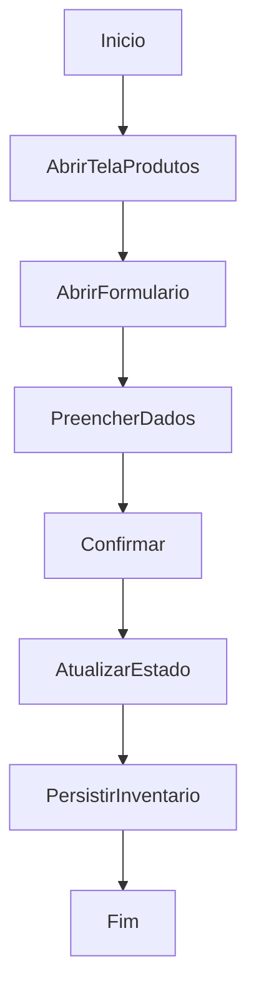

# Cadastro e Edição Manual de Produtos

## Objetivo

Cadastrar ou editar produtos manualmente na interface.

## Gatilho

Abertura do formulário de produto a partir da tela de produtos ou de contexto relacionado.

## Pré-condições

- Usuário autenticado
- Permissão `entry.register`
- Estrutura e estado de inventário carregados

## Fluxo Funcional

1. O usuário abre a tela de produtos.
2. Aciona a criação ou edição de produto.
3. Preenche os dados do formulário.
4. Confirma a operação.
5. O sistema atualiza o estado local e persiste o inventário.

## Fluxo Técnico

1. O frontend renderiza a página por `renderProductsPage`.
2. O formulário é aberto por `openProductForm`.
3. O salvamento ocorre por `saveProductForm`.
4. O frontend atualiza a estrutura de `productsAll`.
5. O frontend persiste o estado por `PUT /api/wms/inventory-state`.
6. O backend valida capacidade e grava o patch de inventário.

## Fluxograma

