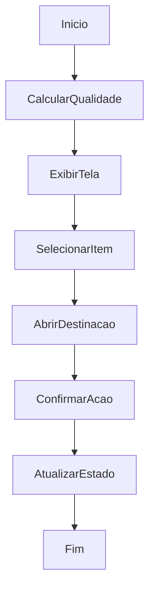

# Cálculo de Qualidade e Destinação

## Objetivo

Calcular estados de qualidade e permitir destinação operacional dos itens.

## Gatilho

Bootstrap do sistema, acesso à tela de qualidade ou ação de destinação.

## Pré-condições

- Estoque existente
- Usuário autenticado

## Fluxo Funcional

1. O usuário acessa a tela de qualidade.
2. O sistema mostra indicadores e lista de itens de qualidade.
3. O usuário pode abrir a ação de destinação de um item.
4. O sistema move o item para o destino escolhido.

## Fluxo Técnico

1. O backend recalcula qualidade por `_rebuild_quality_views` quando necessário.
2. O frontend consome `GET /api/wms/quality/states` e `GET /api/wms/quality/summary`.
3. A tela é montada por `renderQualityPage`.
4. A destinação é iniciada por `openQualityMoveModal`.
5. A persistência exata da destinação: Fluxo incompleto no código atual.

## Fluxograma

