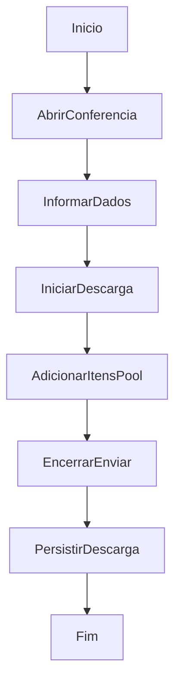

# Conferência Cega de Descarga

## Objetivo

Registrar e conduzir uma descarga com conferência cega.

## Gatilho

Abertura da tela de conferência cega e início manual da descarga.

## Pré-condições

- Usuário autenticado
- Acesso à conferência cega
- Estado de descargas carregado

## Fluxo Funcional

1. O usuário acessa a tela de conferência cega.
2. Informa dados como NF e placa.
3. Inicia a descarga.
4. Adiciona itens conferidos à pool.
5. Encerra e envia a descarga para continuidade/revisão.

## Fluxo Técnico

1. O frontend usa `renderBlindCountPage`.
2. O início da descarga ocorre por `startBlindUnload`.
3. Itens entram na pool por `openBlindPoolModal`.
4. O estado da descarga é persistido por `PUT /api/wms/unloads-state`.
5. O encerramento ocorre por `finalizeBlindUnload`.
6. O backend grava `blindCountRecords`, `activeBlindUnloadId` e pool persistida.

## Fluxograma

