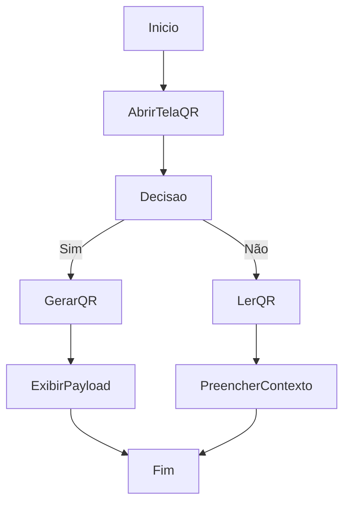

# Geração e Leitura de QR

## Objetivo

Gerar QR de entidades e ler QR por câmera, imagem ou payload manual.

## Gatilho

Acesso à tela de QR e recebimento.

## Pré-condições

- Usuário autenticado
- Tela de QR carregada

## Fluxo Funcional

1. O usuário abre a tela de QR.
2. Pode gerar um QR a partir de seletores e campos.
3. Pode ler QR por câmera.
4. Pode ler QR por imagem.
5. Pode colar um payload manual.
6. O sistema preenche o contexto/formulário de recebimento correspondente.

## Fluxo Técnico

1. O frontend renderiza a área por `renderQrPage`.
2. A geração é tratada por `renderQrGenerator`.
3. A busca de produto de formulário usa `renderQrProductLookup`.
4. A leitura operacional é conduzida por `renderQrWorkflow`.
5. A geração usa `window.QRCode`.
6. A leitura usa `BarcodeDetector` e `getUserMedia` quando disponíveis.

## Fluxograma

