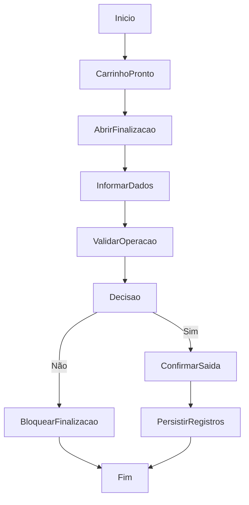

# Geração de Saída ou Descarte

## Objetivo

Finalizar uma operação de saída ou descarte a partir do carrinho operacional.

## Gatilho

Ação de gerar saída na tela de saídas.

## Pré-condições

- Carrinho com itens
- Usuário autenticado
- Permissão `shipment.process` ou `discard.process`

## Fluxo Funcional

1. O usuário monta o carrinho.
2. Abre o modal de finalização.
3. Informa cliente, código e demais dados.
4. Escolhe tipo de operação.
5. Confirma a saída ou descarte.

## Fluxo Técnico

1. O frontend abre o modal com `openFinalizeShippingModal`.
2. O resumo é calculado por `renderFinalizeShippingSummary`.
3. A confirmação ocorre em `confirmFinalizeShipping`.
4. O frontend valida permissões, carrinho e campos obrigatórios.
5. O frontend atualiza registros de saída e inventário.
6. O frontend persiste em `PUT /api/wms/outbound-records-state` e `PUT /api/wms/inventory-state`.
7. Sequência exata de persistência e remoção física dos itens: Fluxo incompleto no código atual.

## Fluxograma

