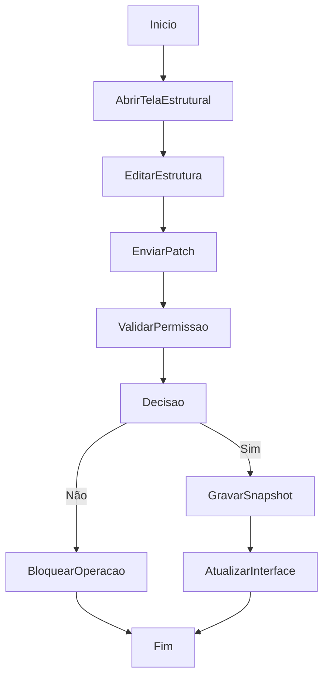

# Gestão Estrutural de Depósitos e Prateleiras

## Objetivo

Manter depósitos, prateleiras, gavetas e depósito ativo na estrutura operacional do sistema.

## Gatilho

Abertura das telas de depósitos/estrutura e ações de criação, edição ou remoção estrutural.

## Pré-condições

- Usuário autenticado
- Permissão compatível com gerenciamento estrutural
- Snapshot estrutural carregado

## Fluxo Funcional

1. O usuário acessa a área de depósitos ou estrutura.
2. Visualiza depósitos e prateleiras existentes.
3. Pode abrir modal de depósito ou painel de edição de prateleira.
4. Ajusta dados estruturais.
5. O sistema salva a nova estrutura e atualiza a interface.

## Fluxo Técnico

1. O frontend renderiza a estrutura com `renderDepotsPage`, `renderDepotTabs`, `renderShelfGrid`.
2. A edição é iniciada por `openDepotModal` ou `openEditShelfPanel`.
3. O frontend envia atualização para `PUT /api/wms/structure-state`.
4. O backend valida permissões via `_enforce_state_permissions`.
5. O backend grava patch estrutural no snapshot com revisão.
6. A nova revisão volta ao frontend.

## Fluxograma

