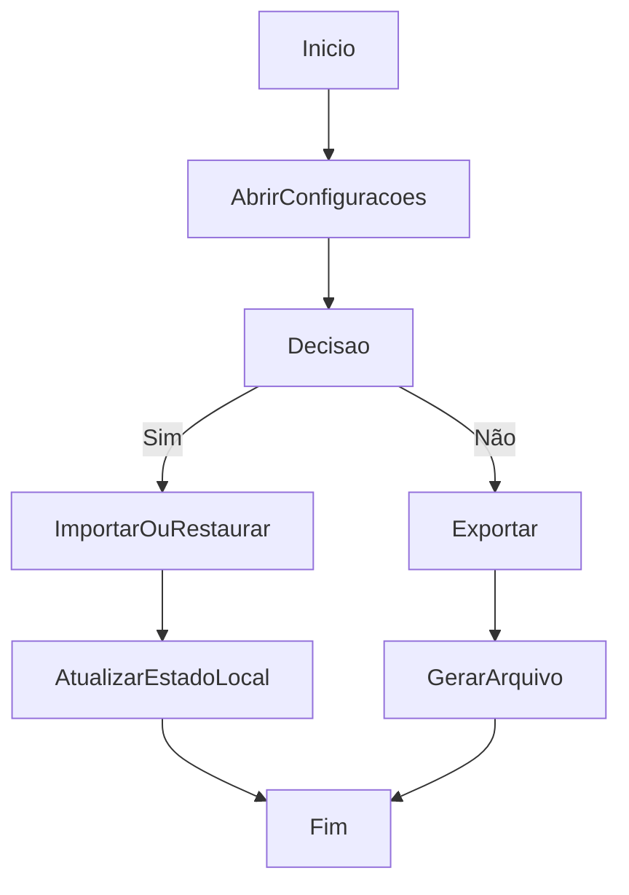

# Importação, Exportação e Restauração Local

## Objetivo

Executar operações locais de importação, exportação e restauração de dados via frontend.

## Gatilho

Acesso à tela de configurações e uso das ações de manutenção local.

## Pré-condições

- Usuário autenticado
- Permissão `settings.manage`

## Fluxo Funcional

1. O usuário abre configurações.
2. Pode importar CSV/JSON.
3. Pode exportar dados em CSV/JSON.
4. Pode restaurar um backup JSON local.
5. O sistema atualiza o estado local e re-renderiza a interface.

## Fluxo Técnico

1. O frontend usa `handleCSVFile`, `previewImport` e `confirmImport` para importação CSV.
2. O frontend usa `exportProductsCSV`, `exportShelvesCSV`, `exportSummaryCSV` e `exportFullJSON` para exportação.
3. O frontend usa `handleJSONFile` para restauração local.
4. As operações usam `FileReader`, serialização JSON e `downloadFile`.
5. Persistência remota imediata após essas ações: Fluxo incompleto no código atual.

## Fluxograma

