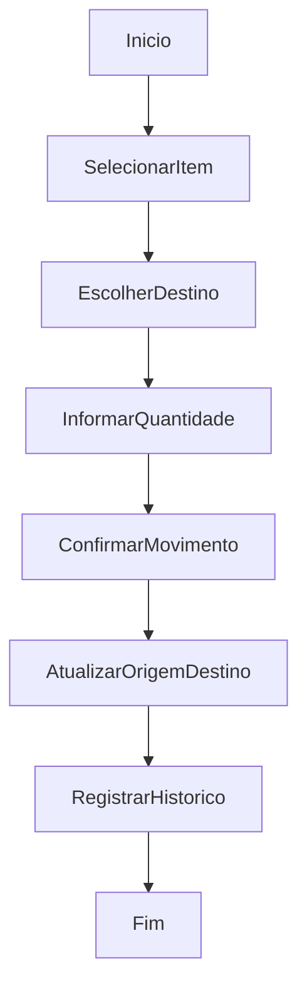

# Movimentação Manual Entre Gavetas

## Objetivo

Mover itens manualmente de uma gaveta para outra.

## Gatilho

Ação de movimentação manual iniciada pelo usuário sobre um item/localização.

## Pré-condições

- Usuário autenticado
- Permissão `entry.register`
- Produto existente em uma gaveta

## Fluxo Funcional

1. O usuário seleciona um item para mover.
2. Escolhe a origem e o destino.
3. Define quantidade/peso quando aplicável.
4. Confirma a movimentação.
5. O sistema atualiza origem, destino e histórico.

## Fluxo Técnico

1. O frontend abre o fluxo por `openMoveModal`.
2. A confirmação ocorre em `confirmMove`.
3. O item é removido/ajustado na origem.
4. O item é inserido/ajustado no destino.
5. O frontend registra histórico via `logHistory`.
6. O frontend re-renderiza e persiste o inventário.

## Fluxograma

