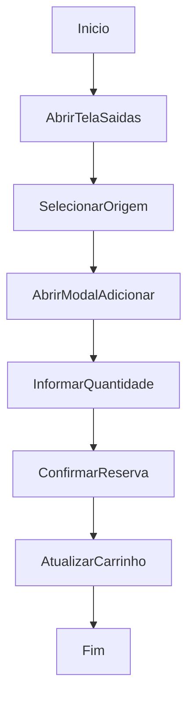

# Separação / Carrinho para Saída

## Objetivo

Reservar itens em um carrinho operacional antes da geração da saída.

## Gatilho

Acesso à tela de saídas e adição de itens ao carrinho.

## Pré-condições

- Usuário autenticado
- Permissão para saída ou descarte
- Estoque carregado

## Fluxo Funcional

1. O usuário abre a tela de saídas.
2. Seleciona depósito, gaveta e item.
3. Adiciona o item ao carrinho.
4. Informa quantidade e peso no modal.
5. Confirma a reserva.

## Fluxo Técnico

1. O frontend monta a tela com `renderShippingPage`.
2. Os itens por gaveta são mostrados em `renderShippingSourceProducts`.
3. A reserva é iniciada por `openShippingAddModalBySignature`.
4. A confirmação acontece em `confirmShippingAdd`.
5. O item é inserido em `outboundCart`.
6. O carrinho é re-renderizado por `renderShippingCart`.

## Fluxograma

