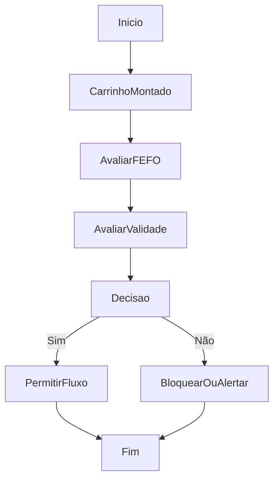

# Validação FEFO e Bloqueio por Validade

## Objetivo

Validar a operação de expedição antes da finalização considerando FEFO e validade mínima.

## Gatilho

Montagem do carrinho e abertura/confirmação da finalização da saída.

## Pré-condições

- Carrinho com itens
- Dados de validade disponíveis para os itens

## Fluxo Funcional

1. O usuário adiciona itens ao carrinho.
2. O sistema compara a seleção com a ordem FEFO.
3. O sistema verifica bloqueios de validade para expedição.
4. O sistema alerta ou bloqueia conforme o caso.

## Fluxo Técnico

1. O frontend executa `evaluateFefoBreak`.
2. O frontend executa `evaluateShipmentExpiryBlocks`.
3. O resultado é exibido em `renderFinalizeShippingSummary`.
4. Se houver bloqueio por validade, `confirmFinalizeShipping` impede a conclusão.
5. Se houver quebra de FEFO, o sistema exige tratamento específico por item.

## Fluxograma

